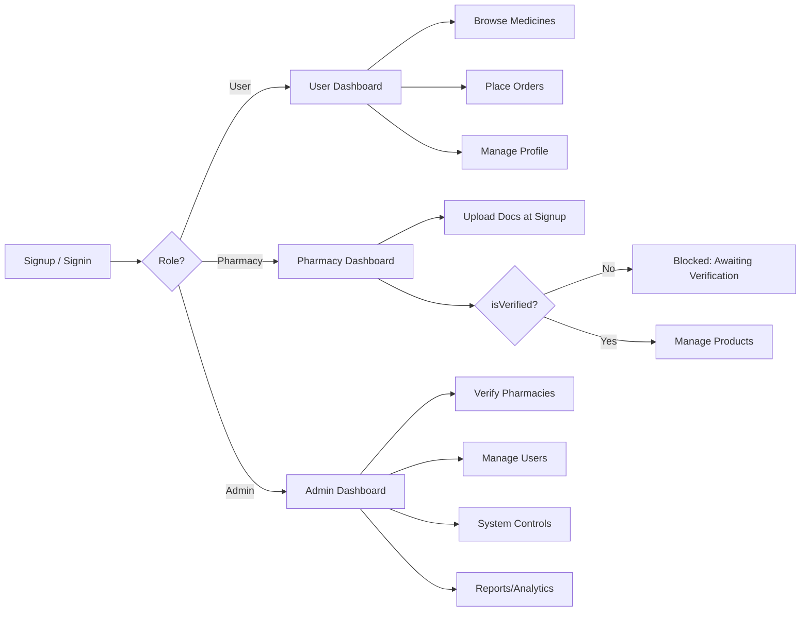

# SignIn and SignUp page
## User 
Simple signup and signin
## Pharmacy
Upload doc
Wait for verify
then signup and sign in
## Admin
Normal signup and sign in

# Home Page
Image
All features
Shop by health concern https://www.1mg.com/?utm_source=chatgpt.com
Names of pharmacy we have

# User Page - Dashboard
Medicines he is taking
Pharmacy he is using
Number of Days he is taking the medicine
Days remaining for the dose
Next check up
Continue the dose
Reminder setter

# Pharmacy Page - Dashboard
Medicine they are having
Number of medicines they have
Upcoming medicines stock
Expiry shower

# Admin Page
Request for approval
yes -> update the flag
Who they have approved and rejected

