# Workflow
🛠 Workflow to Build the Project
Step 1: Plan & Design

Define roles: Patient, Pharmacy, Admin

List features per role:

Patient → Register, Upload Prescription, Search Medicine, Set Reminders

Pharmacy → Register, Upload License, Update Stock, Expiry Alerts

Admin → Login, Verify Pharmacies, Approve/Reject

Draw flowcharts & UI mockups

Define database schema (MongoDB):

Patient, Pharmacy, Admin, Medicines, Prescription, Notifications

Step 2: Setup Backend

Initialize Node.js + Express project:

mkdir backend && cd backend
npm init -y
npm install express mongoose dotenv jsonwebtoken bcryptjs nodemailer

Setup MongoDB connection (config/db.js)

Create Mongoose models (models/)

Build controllers for each role (controllers/)

Setup routes (routes/)

Implement JWT authentication & middleware (middleware/authMiddleware.js)

Implement notifications & reminders logic (utils/notification.js)

Test backend APIs using Postman

Step 3: Setup Frontend

Initialize React project:

npx create-react-app frontend
cd frontend
npm install axios react-router-dom tailwindcss

Configure Tailwind CSS

Create pages: Login, Register, Dashboard (Patient / Pharmacy / Admin)

Create components per role:

Patient: PrescriptionForm, Reminder, SearchMedicine

Pharmacy: Inventory, ExpiryAlerts

Admin: VerifyPharmacies

Setup context or redux for auth state

Create API services to connect frontend with backend (services/)

Step 4: Implement Workflow

Patient Flow

Register → Login → Upload Prescription → Search Medicines → Set Reminder → Push Notification

Pharmacy Flow

Register → Upload License → Wait for Admin Approval → Update Inventory → Trigger Expiry Alerts

Admin Flow

Login → View Pending Pharmacies → Approve / Reject → Notifications

Step 5: Notifications

Patient: Push notifications or alarms for dose reminders

Pharmacy: In-app popup alerts for expiry

Admin: Optional notifications when new pharmacies register

Step 6: Testing

Test role-based access (middleware)

Test API endpoints

Test frontend workflows for each role

Test notifications & reminders

Step 7: Deployment

Backend → Deploy on Heroku / Render / Railway

Frontend → Deploy on Vercel / Netlify

Connect MongoDB Atlas as cloud database

Step 8: Resume & Presentation Ready

Include flowcharts, screenshots, and demo video

Highlight role-based access, real-time notifications, and admin dashboard

****

```mermaid

flowchart TD

%% ------------------ Step 1: Plan & Design ------------------
A[📐 Step 1: Plan & Design] --> B[Define Roles: Patient / Pharmacy / Admin]
B --> C[List Features per Role]
C --> D[Draw Flowcharts & UI Mockups]
D --> E["Define Database Schema (MongoDB)"]

%% ------------------ Step 2: Backend Setup ------------------
E --> F[⚙️ Step 2: Setup Backend]
F --> G[Initialize Node.js + Express Project]
G --> H[Setup MongoDB Connection]
H --> I[Create Mongoose Models]
I --> J[Build Controllers & Routes]
J --> K[Implement JWT Auth & Middleware]
K --> L[Notifications & Reminder Logic]
L --> M[Test APIs with Postman]

%% ------------------ Step 3: Frontend Setup ------------------
M --> N[🖥 Step 3: Setup Frontend]
N --> O[Initialize React Project + Tailwind CSS]
O --> P[Create Pages: Login, Register, Dashboard]
P --> Q[Create Components per Role]
Q --> R[Setup Context / Redux for Auth]
R --> S[Create API Services to Connect Backend]

%% ------------------ Step 4: Implement Workflow ------------------
S --> T[🚀 Step 4: Implement Role Workflows]
T --> U[Patient: Register → Login → Prescription → Reminder]
T --> V[Pharmacy: Register → License Upload → Admin Approval → Inventory Management]
T --> W[Admin: Login → View Pending Pharmacies → Approve/Reject]

%% ------------------ Step 5: Notifications ------------------
U --> X[Patient: Push Notification / Alarm]
V --> Y[Pharmacy: In-App Popup for Expiry]
W --> Z[Admin: Optional Notification for New Registrations]

%% ------------------ Step 6: Testing ------------------
X --> AA[🔍 Step 6: Test Everything]
Y --> AA
Z --> AA
AA --> AB[Test Role-Based Access, APIs, Frontend Workflows, Notifications]

%% ------------------ Step 7: Deployment ------------------
AB --> AC[☁️ Step 7: Deployment]
AC --> AD[Backend → Heroku / Render / Railway]
AC --> AE[Frontend → Vercel / Netlify]
AC --> AF[Connect MongoDB Atlas]

%% ------------------ Step 8: Resume & Presentation ------------------
AF --> AG[🎯 Step 8: Resume & Presentation]
AG --> AH[Include Flowcharts, Screenshots, Demo Video, Highlights]

%% Styles
style A fill:#FCD34D,stroke:#92400E,stroke-width:2px
style F fill:#93C5FD,stroke:#1E40AF,stroke-width:2px
style N fill:#60A5FA,stroke:#1D4ED8,stroke-width:2px
style T fill:#34D399,stroke:#065F46,stroke-width:2px
style X fill:#FBBF24,stroke:#92400E,stroke-width:2px
style AA fill:#F87171,stroke:#7F1D1D,stroke-width:2px
style AC fill:#A78BFA,stroke:#5B21B6,stroke-width:2px
style AG fill:#FCD34D,stroke:#92400E,stroke-width:2px


```

