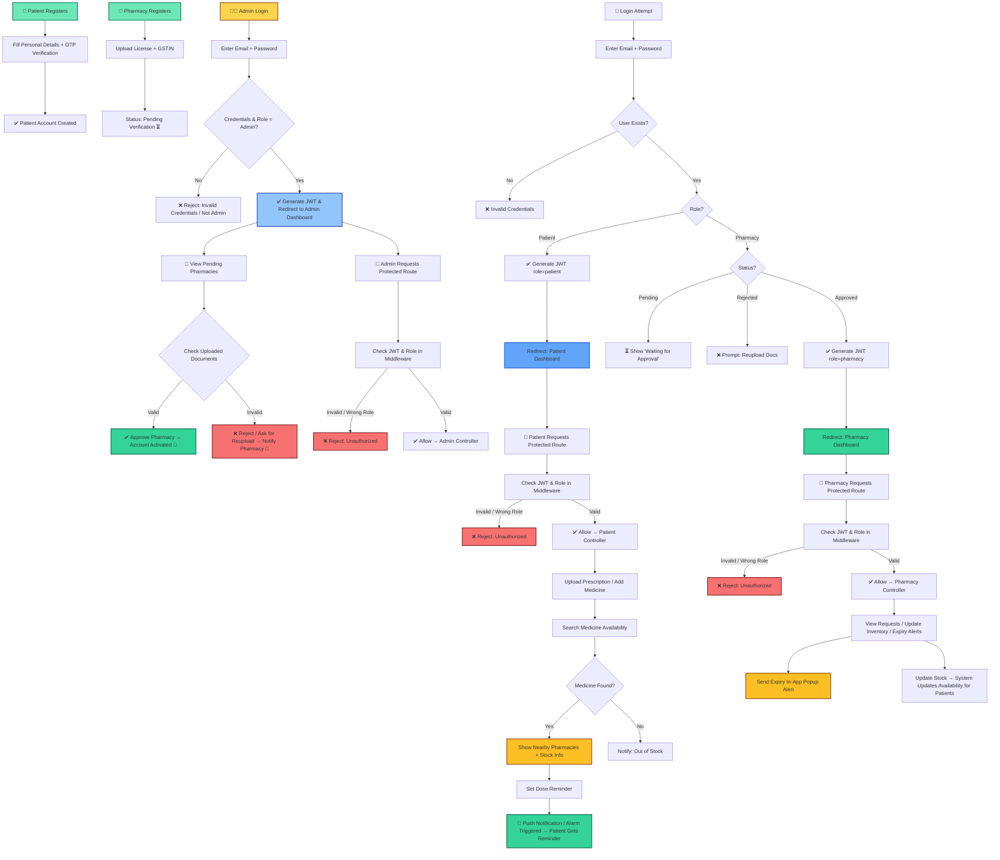
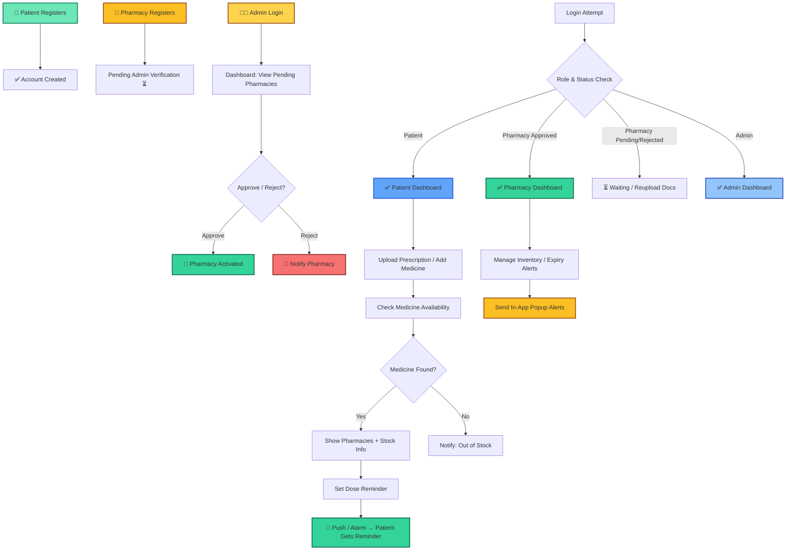

```mermaid
flowchart TD

%% ------------------ Registration ------------------
A1[👤 Patient Registers] --> B1[Fill Personal Details + OTP Verification] --> C1[✅ Patient Account Created]

A2[🏪 Pharmacy Registers] --> B2[Upload License + GSTIN] --> C2[Status: Pending Verification ⏳]

%% ------------------ Admin Login & Dashboard ------------------
AA[👨‍💼 Admin Login] --> AB[Enter Email + Password] --> AC{Credentials & Role = Admin?}
AC -- No --> AD[❌ Reject: Invalid Credentials / Not Admin]
AC -- Yes --> AE[✅ Generate JWT & Redirect to Admin Dashboard]

AE --> AF[📂 View Pending Pharmacies]
AF --> AG{Check Uploaded Documents}
AG -- Valid --> AH[✅ Approve Pharmacy → Account Activated 🎉]
AG -- Invalid --> AI[❌ Reject / Ask for Reupload → Notify Pharmacy 🔔]

%% ------------------ Login & Middleware ------------------
L1[👤 Login Attempt] --> L2[Enter Email + Password] --> L3{User Exists?}
L3 -- No --> L4[❌ Invalid Credentials]
L3 -- Yes --> L5{Role?}

%% Patient Login
L5 -- Patient --> L6[✅ Generate JWT role=patient] --> L7[Redirect: Patient Dashboard]

%% Pharmacy Login
L5 -- Pharmacy --> L8{Status?}
L8 -- Pending --> L9[⏳ Show 'Waiting for Approval']
L8 -- Rejected --> L10[❌ Prompt: Reupload Docs]
L8 -- Approved --> L11[✅ Generate JWT role=pharmacy] --> L12[Redirect: Pharmacy Dashboard]

%% ------------------ Middleware (Protected Routes) ------------------
L7 --> M1[🔑 Patient Requests Protected Route]
L12 --> M2[🔑 Pharmacy Requests Protected Route]
AE --> M3[🔑 Admin Requests Protected Route]

M1 --> N1[Check JWT & Role in Middleware]
M2 --> N2[Check JWT & Role in Middleware]
M3 --> N3[Check JWT & Role in Middleware]

N1 -- Invalid / Wrong Role --> O1[❌ Reject: Unauthorized]
N2 -- Invalid / Wrong Role --> O2[❌ Reject: Unauthorized]
N3 -- Invalid / Wrong Role --> O3[❌ Reject: Unauthorized]

N1 -- Valid --> P1[✅ Allow → Patient Controller]
N2 -- Valid --> P2[✅ Allow → Pharmacy Controller]
N3 -- Valid --> P3[✅ Allow → Admin Controller]

%% ------------------ Patient Features ------------------
P1 --> Q1[Upload Prescription / Add Medicine]
Q1 --> R1[Search Medicine Availability]
R1 --> S1{Medicine Found?}
S1 -- Yes --> T1[Show Nearby Pharmacies + Stock Info]
S1 -- No --> U1[Notify: Out of Stock]

T1 --> V1[Set Dose Reminder]
V1 --> W1[📲 Push Notification / Alarm Triggered → Patient Gets Reminder]

%% ------------------ Pharmacy Features ------------------
P2 --> Q2[View Requests / Update Inventory / Expiry Alerts]
Q2 --> R2[Send Expiry In-App Popup Alert]
Q2 --> S2[Update Stock → System Updates Availability for Patients]

%% ------------------ Styles ------------------
style A1 fill:#6EE7B7,stroke:#047857,stroke-width:2px
style A2 fill:#6EE7B7,stroke:#047857,stroke-width:2px
style AA fill:#FCD34D,stroke:#92400E,stroke-width:2px
style AE fill:#93C5FD,stroke:#1E40AF,stroke-width:2px
style AH fill:#34D399,stroke:#065F46,stroke-width:2px
style AI fill:#F87171,stroke:#7F1D1D,stroke-width:2px
style L7 fill:#60A5FA,stroke:#1D4ED8,stroke-width:2px
style L12 fill:#34D399,stroke:#065F46,stroke-width:2px
style O1 fill:#F87171,stroke:#7F1D1D,stroke-width:2px
style O2 fill:#F87171,stroke:#7F1D1D,stroke-width:2px
style O3 fill:#F87171,stroke:#7F1D1D,stroke-width:2px
style T1 fill:#FBBF24,stroke:#92400E,stroke-width:2px
style W1 fill:#34D399,stroke:#065F46,stroke-width:2px
style R2 fill:#FBBF24,stroke:#92400E,stroke-width:2px
```

****
****
****

```mermaid

flowchart TD

%% ------------------ Registration ------------------
A1[👤 Patient Registers] --> B1[✅ Account Created]
A2[🏪 Pharmacy Registers] --> B2[Pending Admin Verification ⏳]

%% ------------------ Admin Flow ------------------
C1[👨‍💼 Admin Login] --> D1[Dashboard: View Pending Pharmacies]
D1 --> E1{Approve / Reject?}
E1 -- Approve --> F1[🎉 Pharmacy Activated]
E1 -- Reject --> G1[🔔 Notify Pharmacy]

%% ------------------ Login & Middleware ------------------
H1[Login Attempt] --> I1{Role & Status Check}
I1 -- Patient --> J1[✅ Patient Dashboard]
I1 -- Pharmacy Approved --> K1[✅ Pharmacy Dashboard]
I1 -- Pharmacy Pending/Rejected --> L1[⏳ Waiting / Reupload Docs]
I1 -- Admin --> M1[✅ Admin Dashboard]

%% ------------------ Patient Features ------------------
J1 --> N1[Upload Prescription / Add Medicine] --> O1[Check Medicine Availability]
O1 --> P1{Medicine Found?}
P1 -- Yes --> Q1[Show Pharmacies + Stock Info]
P1 -- No --> R1[Notify: Out of Stock]
Q1 --> S1[Set Dose Reminder] --> T1[📲 Push / Alarm → Patient Gets Reminder]

%% ------------------ Pharmacy Features ------------------
K1 --> U1[Manage Inventory / Expiry Alerts] --> V1[Send In-App Popup Alerts]

%% ------------------ Styles ------------------
style A1 fill:#6EE7B7,stroke:#047857,stroke-width:2px
style A2 fill:#FBBF24,stroke:#92400E,stroke-width:2px
style C1 fill:#FCD34D,stroke:#92400E,stroke-width:2px
style J1 fill:#60A5FA,stroke:#1D4ED8,stroke-width:2px
style K1 fill:#34D399,stroke:#065F46,stroke-width:2px
style M1 fill:#93C5FD,stroke:#1E40AF,stroke-width:2px
style F1 fill:#34D399,stroke:#065F46,stroke-width:2px
style G1 fill:#F87171,stroke:#7F1D1D,stroke-width:2px
style T1 fill:#34D399,stroke:#065F46,stroke-width:2px
style V1 fill:#FBBF24,stroke:#92400E,stroke-width:2px

```