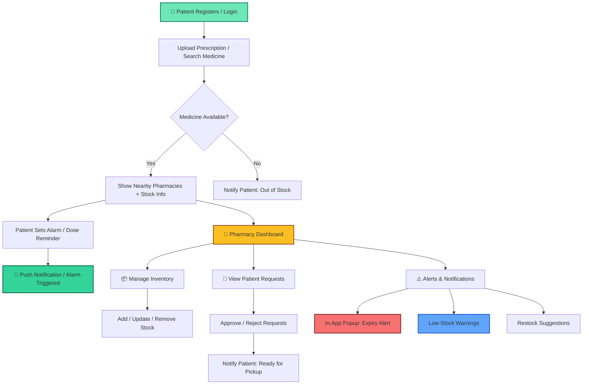

```mermaid

flowchart TD

%% Patient Side
A1[👤 Patient Registers / Login] --> A2[Upload Prescription / Search Medicine]
A2 --> A3{Medicine Available?}

A3 -- Yes --> A4[Show Nearby Pharmacies + Stock Info]
A3 -- No --> A5[Notify Patient: Out of Stock]

A4 --> A6[Patient Sets Alarm / Dose Reminder]
A6 --> A7[📲 Push Notification / Alarm Triggered]

%% Pharmacy Side
A4 --> B1[🏪 Pharmacy Dashboard]
B1 --> B2[📦 Manage Inventory]
B2 --> B3[Add / Update / Remove Stock]

B1 --> B4[📜 View Patient Requests]
B4 --> B5[Approve / Reject Requests]
B5 --> B6[Notify Patient: Ready for Pickup]

%% Alerts
B1 --> C1[⚠️ Alerts & Notifications]
C1 --> C2[In-App Popup: Expiry Alert]
C1 --> C3[Low Stock Warnings]
C1 --> C4[Restock Suggestions]

%% Styles
style A1 fill:#6EE7B7,stroke:#047857,stroke-width:2px
style A7 fill:#34D399,stroke:#065F46,stroke-width:2px
style B1 fill:#FBBF24,stroke:#92400E,stroke-width:2px
style C2 fill:#F87171,stroke:#7F1D1D,stroke-width:2px
style C3 fill:#60A5FA,stroke:#1D4ED8,stroke-width:2px


```
