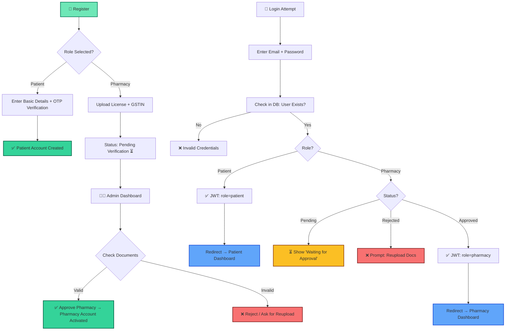
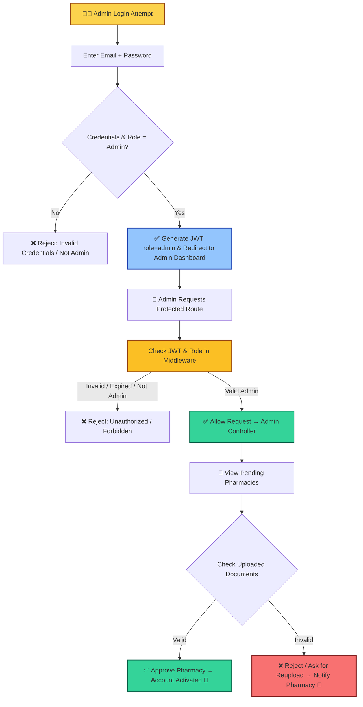

# Pharmacy verification

```mermaid

flowchart TD

%% Registration Phase
A[📝 Register] --> B{Role Selected?}

B -- Patient --> C1[Enter Basic Details + OTP Verification] --> D1[✅ Patient Account Created]

B -- Pharmacy --> C2[Upload License + GSTIN] --> D2[Status: Pending Verification ⏳] --> E[👨‍💼 Admin Dashboard]

E --> F{Check Documents}
F -- Valid --> G[✅ Approve Pharmacy → Pharmacy Account Activated]
F -- Invalid --> H[❌ Reject / Ask for Reupload]

%% Login Phase
I[🔐 Login Attempt] --> J[Enter Email + Password] --> K[Check in DB: User Exists?]

K -- No --> L[❌ Invalid Credentials]

K -- Yes --> M{Role?}

M -- Patient --> N[✅ JWT: role=patient] --> O[Redirect → Patient Dashboard]

M -- Pharmacy --> P{Status?}
P -- Pending --> Q[⏳ Show 'Waiting for Approval']
P -- Rejected --> R[❌ Prompt: Reupload Docs]
P -- Approved --> S[✅ JWT: role=pharmacy] --> T[Redirect → Pharmacy Dashboard]

%% Styling
style A fill:#6EE7B7,stroke:#047857,stroke-width:2px
style D1 fill:#34D399,stroke:#065F46,stroke-width:2px
style G fill:#34D399,stroke:#065F46,stroke-width:2px
style H fill:#F87171,stroke:#7F1D1D,stroke-width:2px
style O fill:#60A5FA,stroke:#1D4ED8,stroke-width:2px
style T fill:#60A5FA,stroke:#1D4ED8,stroke-width:2px
style Q fill:#FBBF24,stroke:#92400E,stroke-width:2px
style R fill:#F87171,stroke:#7F1D1D,stroke-width:2px


```

****
# Admin

```mermaid
flowchart TD

%% Admin Authentication + Middleware Combined
A[👨‍💼 Admin Login Attempt] --> B[Enter Email + Password]
B --> C{Credentials & Role = Admin?}

C -- No --> D[❌ Reject: Invalid Credentials / Not Admin]
C -- Yes --> E[✅ Generate JWT role=admin & Redirect to Admin Dashboard]

%% Protected Route Access
E --> F[🔑 Admin Requests Protected Route]
F --> G[Check JWT & Role in Middleware]

G -- Invalid / Expired / Not Admin --> H[❌ Reject: Unauthorized / Forbidden]
G -- Valid Admin --> I[✅ Allow Request → Admin Controller]

%% Admin Dashboard Actions
I --> J[📂 View Pending Pharmacies]
J --> K{Check Uploaded Documents}
K -- Valid --> L[✅ Approve Pharmacy → Account Activated 🎉]
K -- Invalid --> M[❌ Reject / Ask for Reupload → Notify Pharmacy 🔔]

%% Styles
style A fill:#FCD34D,stroke:#92400E,stroke-width:2px
style E fill:#93C5FD,stroke:#1E40AF,stroke-width:2px
style G fill:#FBBF24,stroke:#92400E,stroke-width:2px
style I fill:#34D399,stroke:#065F46,stroke-width:2px
style L fill:#34D399,stroke:#065F46,stroke-width:2px
style M fill:#F87171,stroke:#7F1D1D,stroke-width:2px
```